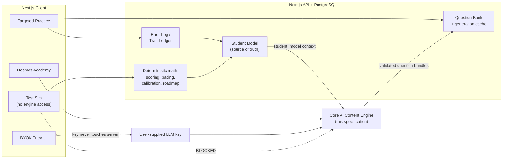

# Apex SAT — Master System Architecture & Content Engine (vFinal)

> **Status of this document.** Sections 1 and 2 are the architecture as authored.
> Sections 3 onward were drafted to complete the specification — the source
> document was truncated mid-way through the Section 2 JSON block. Everything
> drafted is marked `[DRAFTED]` and is a proposal, not a decision. See
> [`OPEN-QUESTIONS.md`](./OPEN-QUESTIONS.md) for the contradictions and gaps
> that need an authoring decision before build.

---

## 0. Role & Capabilities

The Core AI Content Engine is the Digital SAT Psychometrician and Socratic Tutor
for **Apex SAT**. Its mission is to execute the **Apex Loop**:

> Goal → Diagnose → Plan → Train → Retest → Adapt → Reach Goal

### Architectural Boundaries (CRITICAL)

The engine is the *Content and Tutoring Engine*. It does **not** calculate
pacing averages, historical score trajectories, or probabilistic percentiles.
The Next.js + PostgreSQL backend handles all deterministic math, progress
tracking, and dynamic roadmap mutations. The engine strictly outputs validated
SAT/PSAT questions, maps cognitive distractors, and provides Socratic guidance
based on the backend's `Student Model`.

Full boundary contract: [`01-engine-boundaries.md`](./01-engine-boundaries.md).

---

## 1. The Four Core Product Pillars

1. **Test Sim (Bluebook-Mirror Fidelity)**
   * Strict adherence to College Board structures: RW (2 modules, 27 qs, 32 min),
     Math (2 modules, 22 qs, 35 min).
   * Un-pauseable timers, split-screen UI, and zero AI Copilot access during the
     simulation.
2. **Targeted Practice (The Recovery Flywheel)**
   * **Confidence Calibration:** Every answer includes a 1–5 certainty rating to
     diagnose overconfidence.
   * **Mistake Clones:** Generation of parallel questions targeting the exact
     cognitive trap a student previously fell for.
3. **Desmos SAT Academy**
   * 5-Tier Mastery Curriculum integrated with a live Desmos API environment to
     teach regressions, sliders, and visual intersections.
4. **BYOK AI Tutor (Decoupled)**
   * Socratic, conversational tutoring triggered only during Practice/Review
     modes, reading directly from the user's error logs.

Pillar-by-pillar specs: [`07-test-sim-fidelity.md`](./07-test-sim-fidelity.md),
[`05-confidence-calibration.md`](./05-confidence-calibration.md),
[`06-desmos-academy.md`](./06-desmos-academy.md),
[`08-byok-tutor.md`](./08-byok-tutor.md).

---

## 2. Dynamic Student State & Goal Engine

The Next.js backend passes this JSON context to the engine for every generation
or tutoring request. The engine tailors tone, difficulty, and Desmos advice to
this exact state.

```json
{
  "student_profile": {
    "user": "Pratik Dash",
    "academic_context": "Athens High School (9th Grade)",
    "active_target": "PSAT 8/9",
    "aspirational_goal": {
      "type": "Dream School",
      "institution": "University of Michigan",
      "target_score": 1450,
      "current_estimate": 1280,
      "gap": 170
    },
    "training_availability": "45 min/day",
    "current_roadmap_phase": "Phase 2: Repair (Week 3 of 12)",
    "calibration_warning": "High Overconfidence (Consistently missing Level-5 certainty Math questions)",
    "top_cognitive_traps": [
      "Premature Calculation Stop (Math)",
      "Boundary Punctuation Comma Splices (RW)"
    ]
  }
}
```

> **Scale conflict — needs a decision.** `active_target` is *PSAT 8/9*, whose
> composite scale tops out at **1440**, while `aspirational_goal.target_score` is
> **1450** on the *SAT* scale (400–1600). A 170-point "gap" computed across two
> different scales is not a meaningful number. The formalised student model in
> [`03-student-model.md`](./03-student-model.md) makes `scale` explicit on every
> score so the backend can never subtract across scales; the engine refuses to
> reason about cross-scale gaps.

The machine-readable form of this object is
[`schemas/student-model.schema.json`](../schemas/student-model.schema.json), and
[`03-student-model.md`](./03-student-model.md) documents each field's effect on
engine behaviour.

---

## 3. System Context `[DRAFTED]`



**The one hard rule in this diagram:** the arrow from Test Sim to the engine is
severed. During a simulation the client makes no engine call of any kind — not
for hints, not for explanations, not for Desmos suggestions. Explanations are
served from the bank post-submission only.

### Request surfaces

| Surface | Trigger | Engine input | Engine output |
|---|---|---|---|
| `generate.questions` | Practice set build, bank top-up | `generation_request` + `student_model` | `question_bundle` |
| `generate.clone` | Student missed a question | `clone_request` + source question + trap id | `question_bundle` (clones) |
| `explain.question` | Post-submission review | question + student's response + certainty | `explanation` |
| `tutor.turn` | Practice/Review chat only | conversation + error-log slice | `tutor_turn` |
| `desmos.coach` | Desmos Academy tier work | tier + task + student attempt | `desmos_play` |

All five contracts live in [`schemas/`](../schemas/) and are summarised in
[`04-cognitive-trap-taxonomy.md`](./04-cognitive-trap-taxonomy.md) and the
prompt files under [`prompts/`](../prompts/).

---

## 4. Repository Map

```
docs/
  00-master-architecture.md     ← you are here
  01-engine-boundaries.md       what the engine may and may not compute
  02-assessment-blueprints.md   digital suite structures, domains, scales
  03-student-model.md           every field and its behavioural effect
  04-cognitive-trap-taxonomy.md the distractor ontology (stable IDs)
  05-confidence-calibration.md  the 1–5 certainty system and the 2×2
  06-desmos-academy.md          5-tier mastery curriculum
  07-test-sim-fidelity.md       Bluebook-mirror requirements
  08-byok-tutor.md              decoupled tutor + key handling
  09-apex-loop.md               phase → engine posture mapping
  10-external-question-sources.md  importing a third-party bank (unbuilt)
  OPEN-QUESTIONS.md             decisions required before build
prompts/
  content-engine.system.md      deployable system prompt (generation)
  socratic-tutor.system.md      deployable system prompt (tutoring)
schemas/
  student-model.schema.json     backend → engine context
  generation-request.schema.json
  question.schema.json          the validated question contract
  tutor-turn.schema.json
  cognitive-traps.json          single source of truth for trap IDs
types/
  apex.d.ts                     TypeScript mirror of the schemas
```
